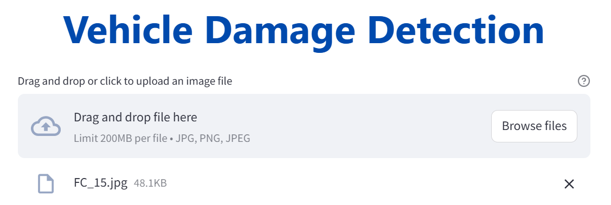
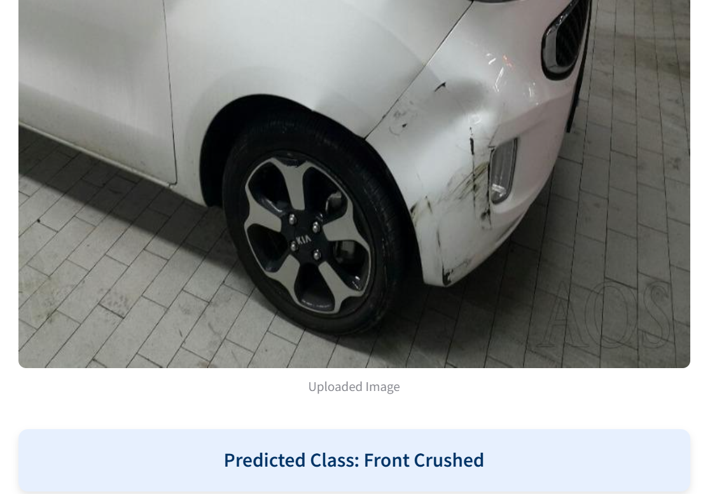

# 🚗 Vehicle Damage Detection

A lightweight computer‑vision pipeline that identifies six common damage categories from a single car photo:

| Label            | Description                              |
| ---------------- | ---------------------------------------- |
| `Front Breakage` | Visible fractures on front bumper/grille |
| `Front Crushed`  | Severe front deformation / crumple       |
| `Front Normal`   | No front‑side damage                     |
| `Rear Breakage`  | Visible fractures on rear bumper         |
| `Rear Crushed`   | Severe rear deformation / crumple        |
| `Rear Normal`    | No rear‑side damage                      |

The project contains three main layers:

1. **`app.py`** – a Streamlit frontend for drag‑and‑drop inference (no external services required).
2. **`model_helper.py`** – wraps a fine‑tuned **ResNet‑50** and handles image transforms + predictions.
3. **Jupyter notebooks** – exploratory training and Optuna‑based hyper‑parameter tuning.

---

## 📸 Screenshots

<p align="center">
  
  
</p>

---

## 🗂️ Repository layout

```text
vehicle-damage-prediction/
├─ app.py                     ← Streamlit UI
├─ server.py                  ← Minimal FastAPI stub (optional deployment)
├─ model_helper.py            ← ResNet50 wrapper + `predict()` function
├─ model/                     ← Trained weights  ➜  model/saved_model.pth
├─ damage_prediction.ipynb    ← End‑to‑end modelling & evaluation
├─ hyperparameter_tunning.ipynb
├─ test_images/               ← Handy samples for quick testing
├─ screenshots/               ← Two default images for README
├─ requirements.txt
└─ README.md                  ← You’re here
```

---

## 📒 Notebook summaries

### 1. `damage_prediction.ipynb`

| Section                            | Highlights                                                                                                         |
| ---------------------------------- | ------------------------------------------------------------------------------------------------------------------ |
| **Load Data**                      | Uses `torchvision.datasets.ImageFolder` with custom `transforms` (resize 224×224, random‑flip, random‑rotation).   |
| **Model 1 – Plain CNN**            | Baseline 3‑conv‑block network built from scratch in **PyTorch**.                                                   |
| **Model 2 – CNN + Regularisation** | Adds dropout + batch‑norm to curb overfitting.                                                                     |
| **Model 3 – EfficientNet‑B0**      | Transfer‑learns on ImageNet weights; faster convergence but slightly lower recall on minority classes.             |
| **Model 4 – ResNet‑50**            | Best top‑1 validation accuracy (\~80 %). Layer‑4 unfrozen, final FC replaced with `Dropout(0.5) → Linear(2048→6)`. |
| **Evaluation**                     | Confusion‑matrix + classification report (precision/recall/F1).                                                    |
| **Save Model**                     | Persists weights to `model/saved_model.pth` for use in the Streamlit app.                                          |

### 2. `hyperparameter_tunning.ipynb`

* Implements **Optuna** for Bayesian optimisation.
* Search space:

  * Learning rate ∈ \[1e‑5, 1e‑2] (log‑uniform)
  * Dropout ∈ \[0.2, 0.7]
* Objective: maximise validation accuracy on a **20 % hold‑out split**.
* Best trial: **lr = 0.005**, **dropout = 0.20** – echoed back into the main notebook for the final training run.

---

## 🚀 Quick start

```bash
# 1. install deps
pip install -r requirements.txt

# 2. launch Streamlit
streamlit run app.py
```

The interface accepts **.jpg / .png** images, displays a preview, and shows the predicted class in an info‑box.

> **Tip:** on first inference the model is loaded lazily; subsequent predictions are instant.

---

## 🛠️ Training from scratch (optional)

1. Place your dataset in `./dataset/<class_name>/image.jpg` folder structure
2. Open `damage_prediction.ipynb`, run all cells (GPU recommended)
3. Weights will auto‑save to `model/saved_model.pth`
4. Launch the app as shown above – it will pick up the new weights automatically.

---

## 🤝 Contributing

Pull requests and issue reports are welcome!

---

## 📄 License

Distributed under the **MIT License** – see `LICENSE` for details.
